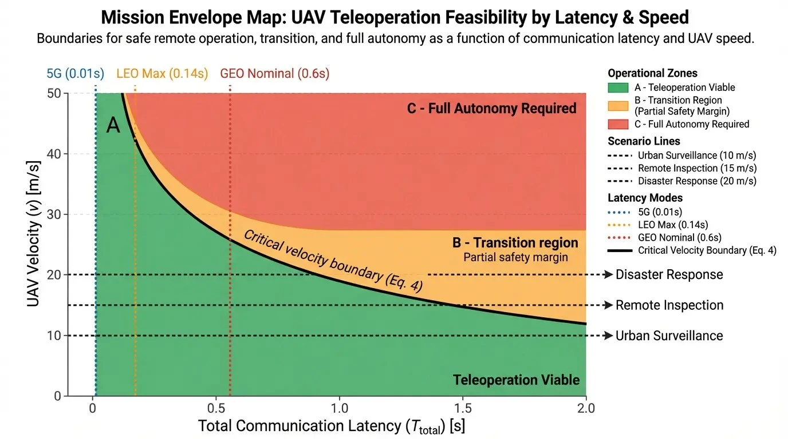
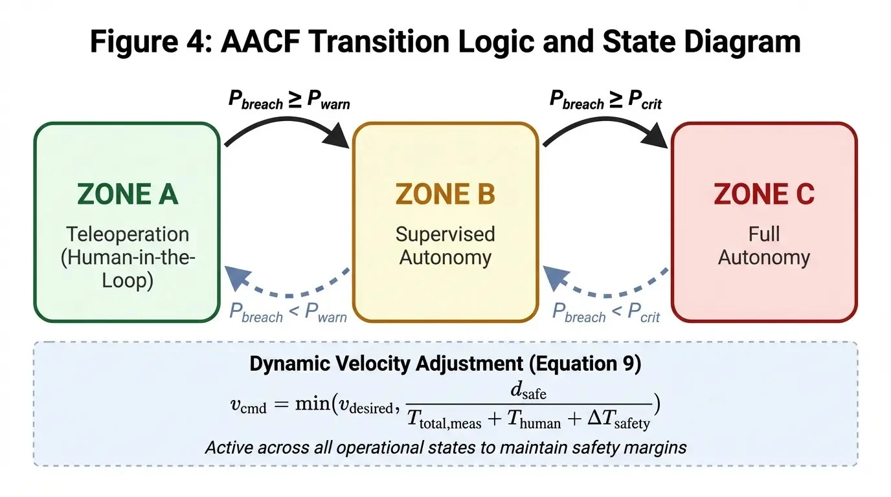

# Latency-Constrained UAV Operations over SATCOM

## 📌 Overview
This repository provides supporting materials for the research study:

**“Latency-Constrained UAV Operations over SATCOM: A System-Level Analytical Framework”** **Nick Barua (2026)**

This work presents a system-level framework for analyzing and mitigating communication latency in satellite-enabled unmanned aerial vehicle (UAV) operations. This study transitions from descriptive analysis to a quantitative, latency-aware modeling approach for Beyond Visual Line of Sight (BVLOS) safety.

---

## 🎨 Graphical Abstract

---

## 🚀 Research Contributions

* **Deterministic Latency Decomposition**: Formal breakdown of end-to-end communication delay.
* **Stochastic Jitter Modeling ($\mathcal{J}$)**: Latency variability in LEO SATCOM environments.
* **Risk-Aware Formulation**: Probabilistic modeling of $P_{breach}$ (Safety Breach).
* **Adaptive Autonomy Control Framework (AACF)**: Dynamic autonomy adaptation based on real-time latency.

---

## 📐 Mathematical Framework

The total deterministic communication latency is defined as:

$$T_{total} = T_{uplink} + T_{satellite} + T_{downlink} + T_{processing}$$

For LEO systems, the model incorporates stochastic jitter ($\mathcal{J}$) to define the total reaction time:

$$T_{reaction} = (T_{total} + \mathcal{J}) + T_{human}$$

---

## 🖼️ Figure Gallery

### Figure 1: SATCOM Communication Loop Decomposition

### Figure 2: Normalized Control Effectiveness vs. Latency

### Figure 3: Mission Envelope Map (Safety Zones)

### Figure 4: AACF State Transition Logic

---

## 📂 Repository Structure

* **`src/`**: Core implementation scripts for latency models and AACF logic.
* **`data/`**: Standardized parameter sets for various mission scenarios.
* **`figures/`**: Python scripts for generating manuscript visuals.

---

## ⚖️ License
Distributed under the MIT License. See `LICENSE` for more information.

## ✉️ Contact
**Nick Barua** – [s.nick.barua@gmail.com](mailto:s.nick.barua@gmail.com)  
*Chairman & CEO, AN Holdings Co.* *Visiting Professor, Shiga University of Medical Science; Kobe Gakuin University*
